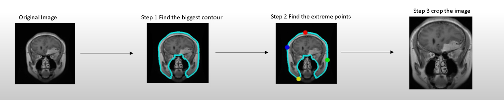

# Transfer Learning with EfficientNet For The Classification of Brain Tumor MR Images

<!-- PROJECT LOGO -->
<br />
<div align="center">
  <a href="https://github.com/othneildrew/Best-README-Template">
    
  </a>

<h3 align="center">Transfer Learning with EfficientNet For The Classification of Brain Tumor MR Images
 <br>An End-to-End Deep Learning Project</h3>

  <p style="text-align: center;"><span style="font-weight: 400;">In this project, we developed and deployed a <strong>classifier for four different types of brain tumor MR images: Glioma, Meningioma, Pituitary and No Tumor</strong>. <br>
Utilizing the method of <strong>transfer learning</strong> and<strong> EfficientNet B3</strong>, the final model achieved an <strong>accuracy rate of 99.23%</strong></span></p>

    
  </p>
</div>

<!-- TABLE OF CONTENTS -->
<details>
<summary> Table of Contents</summary>
<p>🧠 Table of content:</p>
<ol>
    <li>
        <p>About the project 📃</p>
    </li>
    <li>
        <p>Data Pre-Processing ✂️✂️✂️✂️✂️✂️</p>
        <ol>
           <li>
                <p>The Dataset</p>
            </li>
            <li>
                <p>Cropping the original images</p>
            </li>
        </ol>
    </li>
    <li>
        <p>Model Developing &amp; Deploying 🛠️ 🚀</p>
        <ol>
            <li>
                <p>Make the development of applications faster by creating a series of useful functions&nbsp;</p>
            </li>
            <li>
                <p>Generate training, testing, and validation dataframes from testing and training directories (image paths and labels).</p>
            </li>
            <li>
                <p>Manage the balance of the dataset by adding augmented images to minority classes</p>
            </li>
            <li>
                <p>Generates batches of augmented/normalized data for training, testing and validation dataframes</p>
            </li>
            <li>
                <p>Display examples of training images</p>
            </li>
            <li>
                <p>Create models using transfer learning with EfficientNet (B0,B3,B5,B7)</p>
            </li>
            <li>
                <p>Custom model callback</p>
            </li>
            <li>
                <p>Train model</p>
            </li>
            <li>
                <p>Display metrics (loss and accuracy) for training and validation</p>
            </li>
            <li>
                <p>Making prediction on the test set</p>
                <ol>
                    <li>
                        <p>Confusion matrix&nbsp;</p>
                    </li>
                    <li>
                        <p>ROC &amp; AUC curves&nbsp;</p>
                    </li>
                </ol>
            </li>
            <li>
                <p>Export and deploy trained model</p>
            </li>
        </ol>
    </li>
    <li>
        <p>Conclusions!</p>
    </li>
</ol>
<p><br></p>
</details>

<!-- ABOUT THE PROJECT -->
## About The Project

The automatic classification of medical images plays a vital role in diagnosis, growth prediction, and treatment of brain tumors. The earlier a tumor brain is diagnosed, the more likely it will respond to treatment, which ultimately improves the survival rate for patients. Manually classifying brain tumors in large medical image databases is one of the most time-consuming and labor-intensive clinical tasks. As a result, automatic detection and classification procedures are desirable and worthwhile.

This project is focused on multi-class brain tumors classification using pre-trained Convolutional Neural Networks (CNNs) and the EfficientNet B3 learning method.<br>

To achieve enhanced classification results, I applied some image cropping techniques that are specifically used in the medical field. In addition to adding augmented images to minority classes to balance the dataset, I also customized the callback method to automatically adjust the learning rate while training the model for the best accuracy.


<p align="right">(<a href="#readme-top">back to top</a>)</p>

<!-- Data-Pre-Processing -->

## Data Pre-Processing ✂️✂️✂️✂️✂️✂️
### The Dataset
```
Brain Tumor Classification (MRI) Dataset from Kaggle
```
<p><span style="font-weight: 400;">Distribution of images in training dataset directory by each brain tumor classes:&nbsp;</span></p>
<ul>
<li style="font-weight: 400;"><span style="font-weight: 400;">Glioma: 1321</span></li>
<li style="font-weight: 400;"><span style="font-weight: 400;">Meningioma: 1339</span></li>
<li style="font-weight: 400;"><span style="font-weight: 400;">No Tumor: 1595</span></li>
<li style="font-weight: 400;"><span style="font-weight: 400;">Pituitary: 1457</span></li>
</ul>
<p><span style="font-weight: 400;">Distribution of images in testing dataset directory by each brain tumor classes:&nbsp;</span></p>
<ul>
<li style="font-weight: 400;"><span style="font-weight: 400;">Glioma: 300</span></li>
<li style="font-weight: 400;"><span style="font-weight: 400;">Meningioma: 306</span></li>
<li style="font-weight: 400;"><span style="font-weight: 400;">No Tumor: 405</span></li>
<li style="font-weight: 400;"><span style="font-weight: 400;">Pituitary: 300</span></li>
</ul>

### More Information

```angular2html
Source: John Hopkins Medical Center
```
| Glioma |  Meningioma | No Tumor                |  Pituitary |
|--------|---|-------------------------|---|
|        |   |  |   |
<p>Glioma</p>
<ul>
<li style="font-weight: 400;"><span style="font-weight: 400;">Gliomas account for 33% of all brain tumors, which arise from gluey supporting cells surrounding and supporting neurons.</span></li>
<li style="font-weight: 400;"><span style="font-weight: 400;">Depending on its location and growth rate, glioma can affect brain function and be life-threatening</span></li>
</ul>
<p><span style="font-weight: 400;">Meningioma</span></p>
<ul>
<li style="font-weight: 400;"><span style="font-weight: 400;">Generally, meningioma tumors begin in the brain or spinal cord (central nervous system).</span></li>
<li style="font-weight: 400;"><span style="font-weight: 400;">90% of meningioma tumors are benign (not cancerous)</span></li>
</ul>
<p><span style="font-weight: 400;">Pituitary</span></p>
<ul>
<li style="font-weight: 400;"><span style="font-weight: 400;">Pituitary tumor is a tumor that forms in the pituitary gland near the brain that can cause changes in hormones</span> <span style="font-weight: 400;">level in the body</span></li>
<li style="font-weight: 400;"><span style="font-weight: 400;">Most pituitary tumors are noncancerous growth</span></li>
<li style="font-weight: 400;"><span style="font-weight: 400;">Pituitary cancers are very rare</span></li>
</ul>
<p>&nbsp;</p>


## Images Cropping 
<ul>
<li><span style="font-weight: 400;">To make the MR images uniformly sized, resize all of them to 256x256 pixels</span></li>
<li><span style="font-weight: 400;">Noise was another major issue with the MR images. For this reason, we need to crop out the unnecessary portion of the input images to improve their quality. </span></li>
<li><span style="font-weight: 400;">Exported the cropped MR images to other directory and ready for feeding the model </span></li>
</ul>



## Model Developing & Deploying 🛠️ 🚀

### Make the development of applications faster by creating a series of useful functions

### Generate training, testing, and validation dataframes from testing and training directories (image paths and labels).

### Manage the balance of the dataset by adding augmented images to minority classes

### Generates batches of augmented/normalized data for training, testing and validation dataframes

### Display examples of training images

### Create models using transfer learning with EfficientNet (B0,B3,B5,B7)

### Custom model callback

### Train model

### Display metrics (loss and accuracy) for training and validation

### Making prediction on the test set

### Confusion matrix

### ROC & AUC curves

## Export and deploy trained model


