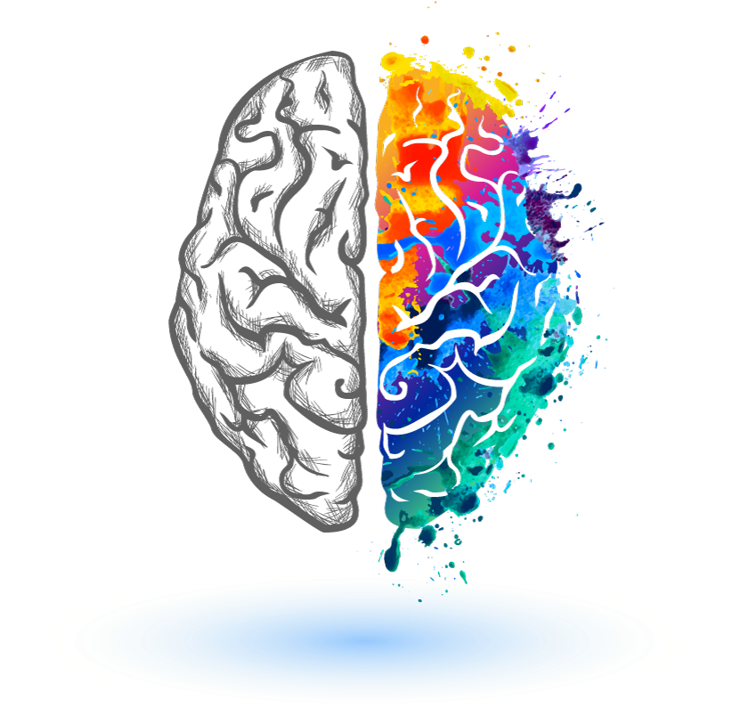
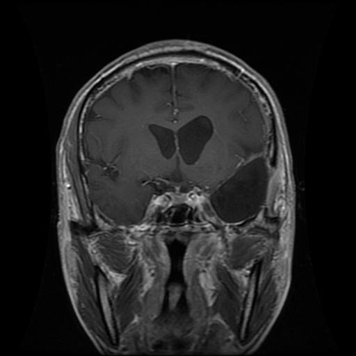
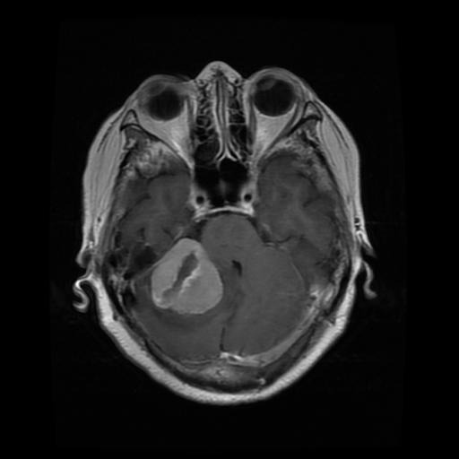
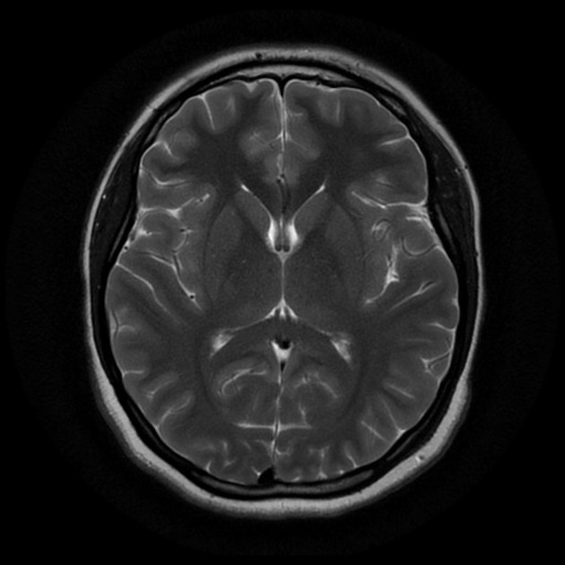
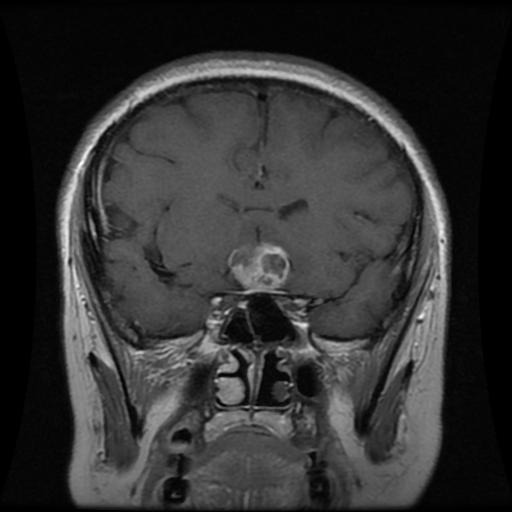
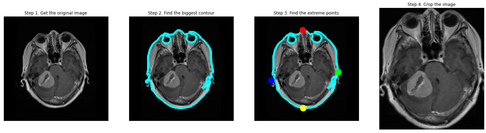
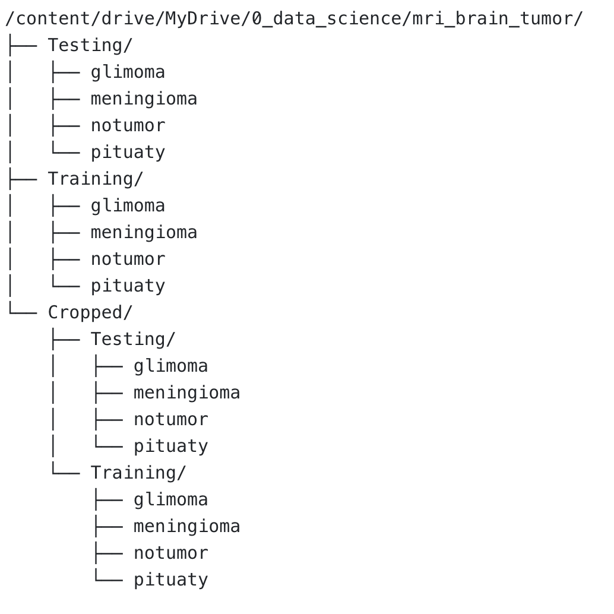
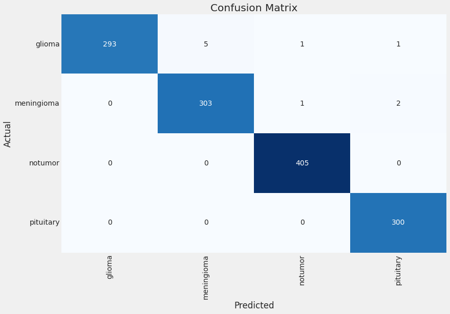
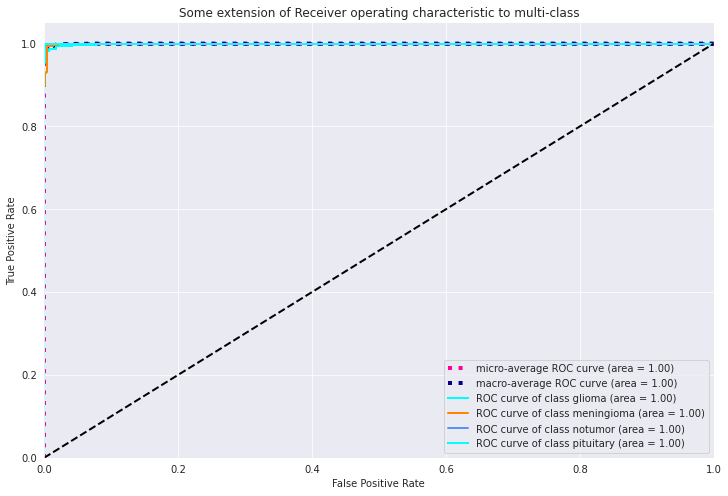

# Transfer Learning with EfficientNet For The Classification of Brain Tumor MR Images

<!-- PROJECT LOGO -->
<br />
<div align="center">
  <a href="https://github.com/othneildrew/Best-README-Template">
    
  </a>

<h3 align="center">Transfer Learning with EfficientNet For The Classification of Brain Tumor MR Images
 <br>An End-to-End Deep Learning Project</h3>

  <p style="text-align: center;"><span style="font-weight: 400;">In this project, we developed and deployed a <strong>classifier for four different types of brain tumor MR images: Glioma, Meningioma, Pituitary and No Tumor</strong>. <br>
Utilizing the method of <strong>transfer learning</strong> and<strong> EfficientNet B3</strong>, the final model achieved an <strong>accuracy rate of 99.23%</strong></span></p>

    
  </p>
</div>

<!-- TABLE OF CONTENTS -->
<details>
<summary> Table of Contents</summary>
<p>🧠 Table of content:</p>
<ol>
    <li>
        <p>About the project 📃</p>
    </li>
    <li>
        <p>Data Pre-Processing ✂️✂️✂️✂️✂️✂️</p>
        <ol>
           <li>
                <p>The Dataset</p>
            </li>
           <li>
                <p>Libraries</p>
            </li>
            <li>
                <p>Cropping the original images</p>
            </li>
        </ol>
    </li>
    <li>
        <p>Model Developing &amp; Deploying 🛠️ 🚀</p>
        <ol>
            <li>
                <p>Make the development of applications faster by creating a series of useful functions&nbsp;</p>
            </li>
            <li>
                <p>Generate training, testing, and validation dataframes from testing and training directories (image paths and labels).</p>
            </li>
            <li>
                <p>Manage the balance of the dataset by adding augmented images to minority classes</p>
            </li>
            <li>
                <p>Generates batches of augmented/normalized data for training, testing and validation dataframes</p>
            </li>
            <li>
                <p>Display examples of training images</p>
            </li>
            <li>
                <p>Create models using transfer learning with EfficientNet (B0,B3,B5,B7)</p>
            </li>
            <li>
                <p>Custom model callback</p>
            </li>
            <li>
                <p>Train model</p>
            </li>
            <li>
                <p>Display metrics (loss and accuracy) for training and validation</p>
            </li>
            <li>
                <p>Making prediction on the test set</p>
                <ol>
                    <li>
                        <p>Confusion matrix&nbsp;</p>
                    </li>
                    <li>
                        <p>ROC &amp; AUC curves&nbsp;</p>
                    </li>
                </ol>
            </li>
            <li>
                <p>Export and deploy trained model</p>
            </li>
        </ol>
    </li>
    <li>
        <p>Conclusions!</p>
    </li>
</ol>
<p><br></p>
</details>

<!-- ABOUT THE PROJECT -->
## About The Project

The automatic classification of medical images plays a vital role in diagnosis, growth prediction, and treatment of brain tumors. The earlier a tumor brain is diagnosed, the more likely it will respond to treatment, which ultimately improves the survival rate for patients. Manually classifying brain tumors in large medical image databases is one of the most time-consuming and labor-intensive clinical tasks. As a result, automatic detection and classification procedures are desirable and worthwhile.

This project is focused on multi-class brain tumors classification using pre-trained Convolutional Neural Networks (CNNs) and the EfficientNet B3 learning method.<br>

To achieve enhanced classification results, I applied some image cropping techniques that are specifically used in the medical field. In addition to adding augmented images to minority classes to balance the dataset, I also customized the callback method to automatically adjust the learning rate while training the model for the best accuracy.


<p align="right">(<a href="#readme-top">back to top</a>)</p>

<!-- Data-Pre-Processing -->

## Data Pre-Processing ✂️✂️✂️✂️✂️✂️
### The Dataset
```
Brain Tumor Classification (MRI) Dataset from Kaggle
```
<p><span style="font-weight: 400;">Distribution of images in training dataset directory by each brain tumor classes:&nbsp;</span></p>
<ul>
<li style="font-weight: 400;"><span style="font-weight: 400;">Glioma: 1321</span></li>
<li style="font-weight: 400;"><span style="font-weight: 400;">Meningioma: 1339</span></li>
<li style="font-weight: 400;"><span style="font-weight: 400;">No Tumor: 1595</span></li>
<li style="font-weight: 400;"><span style="font-weight: 400;">Pituitary: 1457</span></li>
</ul>
<p><span style="font-weight: 400;">Distribution of images in testing dataset directory by each brain tumor classes:&nbsp;</span></p>
<ul>
<li style="font-weight: 400;"><span style="font-weight: 400;">Glioma: 300</span></li>
<li style="font-weight: 400;"><span style="font-weight: 400;">Meningioma: 306</span></li>
<li style="font-weight: 400;"><span style="font-weight: 400;">No Tumor: 405</span></li>
<li style="font-weight: 400;"><span style="font-weight: 400;">Pituitary: 300</span></li>
</ul>

#### More Information

```angular2html
Source: John Hopkins Medical Center
```
| Glioma |  Meningioma | No Tumor                |  Pituitary |
|--------|---|-------------------------|---|
|        |   |  |   |
<p>Glioma</p>
<ul>
<li style="font-weight: 400;"><span style="font-weight: 400;">Gliomas account for 33% of all brain tumors, which arise from gluey supporting cells surrounding and supporting neurons.</span></li>
<li style="font-weight: 400;"><span style="font-weight: 400;">Depending on its location and growth rate, glioma can affect brain function and be life-threatening</span></li>
</ul>
<p><span style="font-weight: 400;">Meningioma</span></p>
<ul>
<li style="font-weight: 400;"><span style="font-weight: 400;">Generally, meningioma tumors begin in the brain or spinal cord (central nervous system).</span></li>
<li style="font-weight: 400;"><span style="font-weight: 400;">90% of meningioma tumors are benign (not cancerous)</span></li>
</ul>
<p><span style="font-weight: 400;">Pituitary</span></p>
<ul>
<li style="font-weight: 400;"><span style="font-weight: 400;">Pituitary tumor is a tumor that forms in the pituitary gland near the brain that can cause changes in hormones</span> <span style="font-weight: 400;">level in the body</span></li>
<li style="font-weight: 400;"><span style="font-weight: 400;">Most pituitary tumors are noncancerous growth</span></li>
<li style="font-weight: 400;"><span style="font-weight: 400;">Pituitary cancers are very rare</span></li>
</ul>
<p>&nbsp;</p>

### Libraries
* Opencv-python 4.6.0.66
* imutils
  * A series of convenience functions to make basic image processing functions such as translation, rotation, resizing, skeletonization, displaying Matplotlib images, sorting contours, detecting edges, and much more easier with OpenCV and both Python 2.7 and Python 3.
* matplotlib
* PIL
  * Python Imaging Library adds image processing capabilities to your Python interpreter.
* seaborn
* shutil
* sklearn
* tensorflow
* keras
* time
* tqdm


### Images Cropping 
<ul>
<li><span style="font-weight: 400;">To make the MR images uniformly sized, resize all of them to 256x256 pixels</span></li>
<li><span style="font-weight: 400;">Noise was another major issue with the MR images. For this reason, we need to crop out the unnecessary portion of the input images to improve their quality. </span></li>
<li><span style="font-weight: 400;">Exported the cropped MR images to other directory and ready for feeding the model </span></li>
</ul>



## Model Developing & Deploying 🛠️ 🚀

### Make the development of applications faster by creating a series of useful functions

### Generate training, testing, and validation dataframes from testing and training directories
* Create a dataframe of image paths and class labels by reading in images
  

<table class="dataframe" border="1">
<thead>
<tr>
<th>filepaths</th>
<th>labels</th>
</tr>
</thead>
<tbody>
<tr>
<th>2209</th>
<td>/content/drive/MyDrive/0_data_science/mri_brai...</td>
<td>meningioma</td>
</tr>
<tr>
<th>907</th>
<td>/content/drive/MyDrive/0_data_science/mri_brai...</td>
<td>glioma</td>
</tr>
</tbody>
</table>

### Manage the balance of the dataset by adding augmented images to minority classes
* Creating a new folder named 'new_aug' for storing augmented images
* Apply image augmentation by rotating, shifting, and flipping horizontally
* Merge newly augmented images paths and labels with existing dataframes for training/testing/validation

### Generate batches of augmented/normalized data for training, testing and validation dataframes
* Using the flow_from_dataframe function, generate batches of tensor image data with real-time data augmentation
  * Tensorflow can use a dataframe to determine which images to use and what classification each image belongs to.

* In the test_gen, we want to calculate the batch size and test steps such that `batch_size` * `test_steps` = number of samples in the test set
  * By doing this, we ensure that we run through all sample sets exactly once.

### Display examples of training images

* Display the first 25 images along with their labels of the first batch in training data generator

### Create models using transfer learning with EfficientNet (B0,B3,B5,B7)
* Training our model using EfficientNet with transferred imagenet weights as a base model
* Removing the top layer from our base model and setting it to non-trainable
  * By doing this, we can pass the image data through the pretrained model and get an output
  *  Using this output as inputs for our additional dense layers, we will be able to train them.
### Custom model callback

When training is complete, the model weights are set to the epoch with the lowest validation loss.
`callbacks= LR_ASK(model, epochs,  ask_epoch, dwell=True, factor=.4)`
* model: A string representing the name of the compiled model
* epochs: An integer representing the number of epochs to run specified in model.fit
* ask_epochs: if ask_epochs = 10, the model will train for 10 epochs before asking for user input
*   User input: `h` or a number (integer value)
* `H` or `h': ex: `ask_epochs = h` the model training process would be halted
* A number (integer value): for example `ask_epochs = 5` would continue training for 5 epochs, then the user would be asked for the new value.
* dwell: a boolean value (True/False)
  * True: the model will keep track of the current epoch validation loss and compare it with the lowest validation loss so far.
    * If the current epoch validation loss is less than the lowest validation loss, the current epoch weights would be saved at the best weight
    * When the current epoch validation loss exceeds the lowest validation loss, the new learning rate would be lowered by multiplying the current learning rate by the `factor` (a float value between 0 & 1)

### Train model

### Display metrics (loss and accuracy) for training and validation
* Graph the change in validation accuracy values and validation loss values between training and validating datasets over time.

### Making prediction on the test set
* Define a function which takes in a test generator and an integer 'test_steps'
* A confusion matrix is generated based on the test set predictions
* Generate classification report



<table style="height: 234px;" width="605">
<tbody>
<tr>
<td style="width: 114.195px;">&nbsp;</td>
<td style="width: 114.195px;">precision</td>
<td style="width: 114.195px;">recall</td>
<td style="width: 114.195px;">f1-score</td>
<td style="width: 114.219px;">support</td>
</tr>
<tr>
<td style="width: 114.195px;">glioma&nbsp; &nbsp;&nbsp;</td>
<td style="width: 114.195px;">1.0000</td>
<td style="width: 114.195px;">0.9767</td>
<td style="width: 114.195px;">0.9882</td>
<td style="width: 114.219px;">300</td>
</tr>
<tr>
<td style="width: 114.195px;">meningioma&nbsp; &nbsp;&nbsp;</td>
<td style="width: 114.195px;">0.9838</td>
<td style="width: 114.195px;">0.9902</td>
<td style="width: 114.195px;">0.9870</td>
<td style="width: 114.219px;">306</td>
</tr>
<tr>
<td style="width: 114.195px;">notumor&nbsp; &nbsp;&nbsp;</td>
<td style="width: 114.195px;">0.9951</td>
<td style="width: 114.195px;">1.0000</td>
<td style="width: 114.195px;">0.9975</td>
<td style="width: 114.219px;">405</td>
</tr>
<tr>
<td style="width: 114.195px;">pituitary&nbsp; &nbsp;&nbsp;</td>
<td style="width: 114.195px;">0.9901</td>
<td style="width: 114.195px;">1.0000</td>
<td style="width: 114.195px;">0.9950</td>
<td style="width: 114.219px;">300</td>
</tr>
<tr>
<td style="width: 114.195px;">accuracy</td>
<td style="width: 114.195px;">&nbsp;</td>
<td style="width: 114.195px;">&nbsp;</td>
<td style="width: 114.195px;">0.9924&nbsp;</td>
<td style="width: 114.219px;">1311</td>
</tr>
<tr>
<td style="width: 114.195px;">macro avg</td>
<td style="width: 114.195px;">0.9922&nbsp; &nbsp;</td>
<td style="width: 114.195px;">0.9917</td>
<td style="width: 114.195px;">0.9919</td>
<td style="width: 114.219px;">1311</td>
</tr>
<tr>
<td style="width: 114.195px;">weighted avg</td>
<td style="width: 114.195px;">0.9924</td>
<td style="width: 114.195px;">0.9924</td>
<td style="width: 114.195px;">0.9924</td>
<td style="width: 114.219px;">1311</td>
</tr>
</tbody>
</table>

### ROC & AUC curves


## Export and deploy trained model


